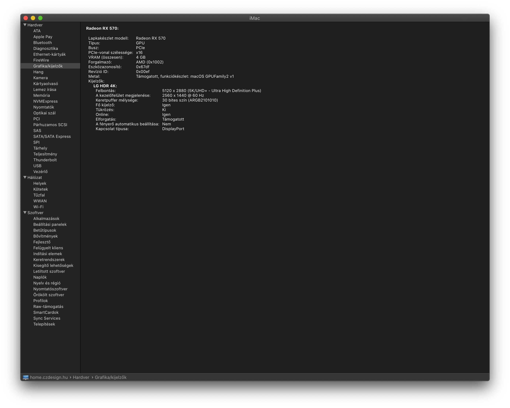

! **This is the last Clover update. I will use OpenCore bootloaer in the future.**

# Hackintosh Catalina Installation Guide for ASUS ROG STRIX Z390-I GAMING
Build a Perfect Vanilla Hackintosh.

## Hardware

- Gigabyte ASUS ROG STRIX Z390-I GAMING
- Intel Core i3-8100
- 2 x Kingston HyperX Predator 8GB DDR4 3000MHz
- 1 x SAPPHIRE PULSE Radeon RX 570 ITX 4GB
- 1 x Samsung SSD 850 EVO 250GB
- 1 x Broadcom BCM94350ZAE/DW1820A M.2 WiFi/ac and BT4LE (replaced on the motherboard)
  - BCM4350 cards proved unreliable in terms of usage. Only some models work properly
  - BCM94352Z/DW1560 is better

## Everything Works

- Sleep (fans and RGB LEDs included)
- Power Nap (sleep with background operations such as Time Machine)
- Wake
- Audio (select internal speakers)
- Ethernet
- Bluetooth
- WiFi
- All USB and USB 3.1 ports
- Nightshift (no kexts required)
